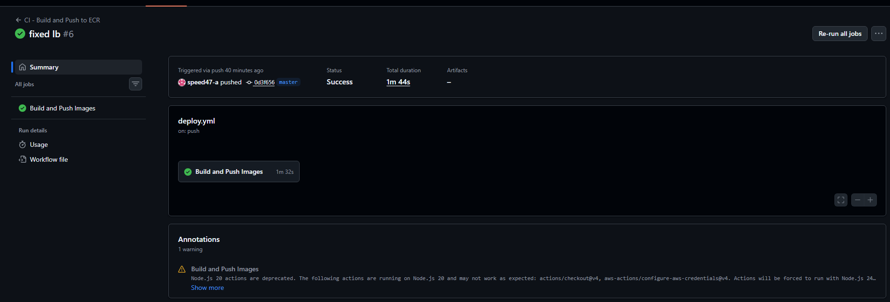
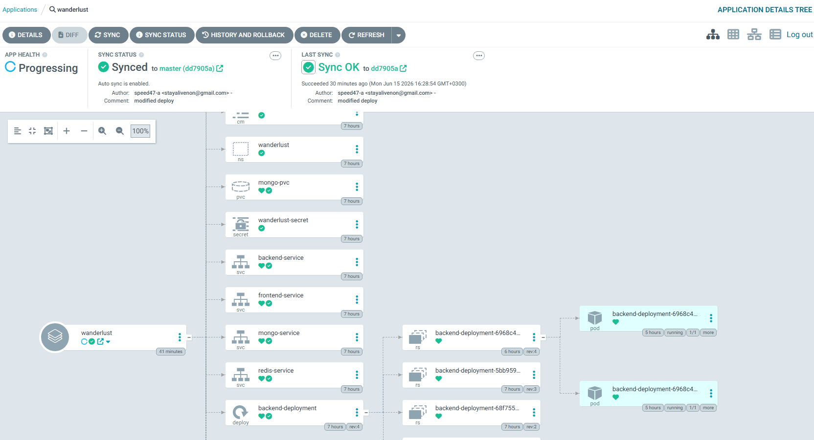
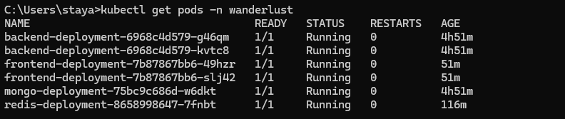
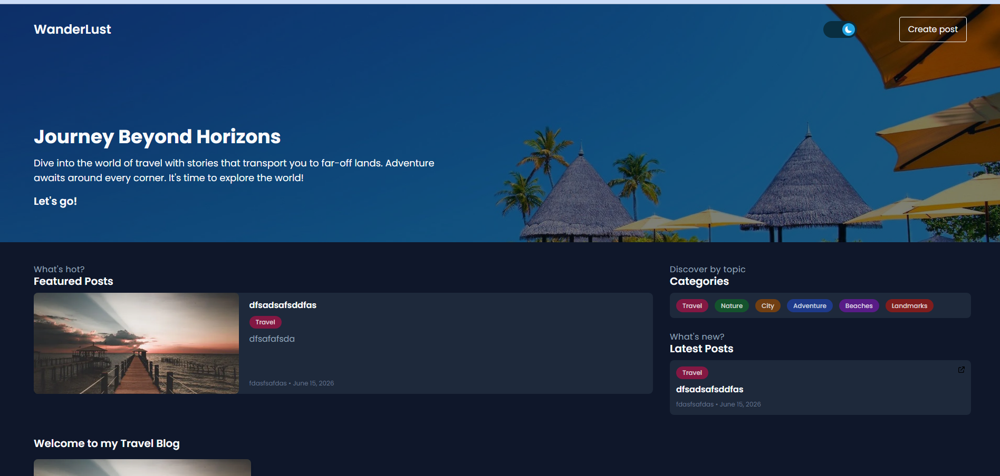

# 🌍 Wanderlust EKS — Cloud-Native Deployment on AWS

A production-ready deployment of the Wanderlust MERN travel blog application on AWS EKS using GitOps principles with ArgoCD, automated CI/CD via GitHub Actions, and infrastructure provisioned via Terraform.

---

## 🏗️ Architecture

```
Developer → GitHub Actions (CI) → Docker Hub → GitHub (manifests)
                                                      ↓
                                                   ArgoCD
                                                      ↓
                                                  AWS EKS
                                                      ↑
                                                 Terraform
                                              (Infrastructure)
```

- **Terraform** provisions the EKS cluster, VPC, subnets, and IAM roles
- **GitHub Actions** builds and pushes Docker images on every commit
- **ArgoCD** watches the GitHub repo and syncs Kubernetes manifests automatically
- **Helm** manages Kubernetes application packaging and releases
- **AWS EKS** runs the containerized MERN stack workloads

---

## 🛠️ Tech Stack

| Layer | Technology |
|---|---|
| Cloud | AWS (EKS, ELB, VPC, IAM) |
| Infrastructure as Code | Terraform |
| Container Orchestration | Kubernetes (EKS) |
| Package Manager | Helm |
| CI/CD | GitHub Actions |
| GitOps / CD | ArgoCD |
| Frontend | React (Vite) |
| Backend | Node.js / Express |
| Database | MongoDB |
| Cache | Redis |

---

## 📁 Project Structure

```
wanderlust-eks/
├── .github/
│   └── workflows/
│       └── ci.yaml
├── helm/
│   ├── Chart.yaml
│   ├── values.yaml
│   └── templates/
│       ├── frontend-deployment.yaml
│       ├── frontend-service.yaml
│       ├── backend-deployment.yaml
│       ├── backend-service.yaml
│       ├── mongo-deployment.yaml
│       └── redis-deployment.yaml
└── terraform/
    ├── main.tf
    ├── variables.tf
    └── outputs.tf
```

---

## 🚀 Getting Started

### Prerequisites

- AWS CLI configured with appropriate IAM permissions
- Terraform >= 1.0
- kubectl
- Helm >= 3.0
- ArgoCD CLI

### 1. Provision Infrastructure

```bash
cd terraform
terraform init
terraform plan
terraform apply
```

### 2. Update kubeconfig

```bash
aws eks update-kubeconfig --name wanderlust --region us-east-1
```

### 3. Install ArgoCD

```bash
kubectl create namespace argocd
kubectl apply -n argocd -f https://raw.githubusercontent.com/argoproj/argo-cd/stable/manifests/install.yaml
```

### 4. Access ArgoCD UI

```bash
kubectl get svc argocd-server -n argocd
```

Open the EXTERNAL-IP in your browser. Login with:
- Username: `admin`
- Password: `kubectl get secret argocd-initial-admin-secret -n argocd -o jsonpath="{.data.password}" | base64 -d`

### 5. Deploy with Helm via ArgoCD

Create the ArgoCD application pointing to the Helm chart in this repo. ArgoCD will automatically sync and deploy all resources to the `wanderlust` namespace.

```bash
kubectl get pods -n wanderlust
kubectl get svc -n wanderlust
```

---

## 🔁 CI/CD Workflow

### Continuous Integration (GitHub Actions)
On every push to `main`:
1. Builds Docker images for frontend and backend
2. Pushes images to Docker Hub with updated tags
3. Updates the Helm values with the new image tag

### Continuous Delivery (ArgoCD)
1. ArgoCD detects the updated Helm values in GitHub
2. Automatically syncs changes to the EKS cluster
3. Zero manual `kubectl apply` needed

---

## 🌐 Accessing the App

Once deployed, get the frontend LoadBalancer URL:

```bash
kubectl get svc frontend-service -n wanderlust
```

Open `http://<EXTERNAL-IP>:5173` in your browser.

---

## 🧹 Teardown

```bash
kubectl delete namespace wanderlust
kubectl delete namespace argocd
cd terraform && terraform destroy
```
## 📸 Deployment Evidence

### GitHub Actions CI Pipeline


### ArgoCD GitOps Deployment


### Kubernetes Workloads


### Application Running on AWS EKS

---
Mohamed ashraf Junior Devops
